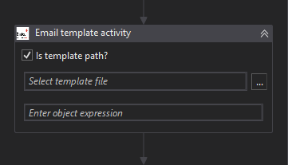
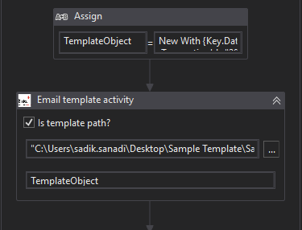
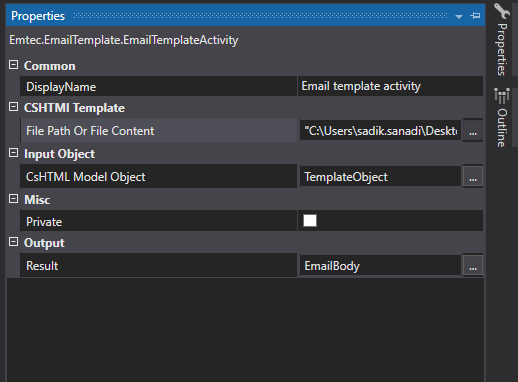
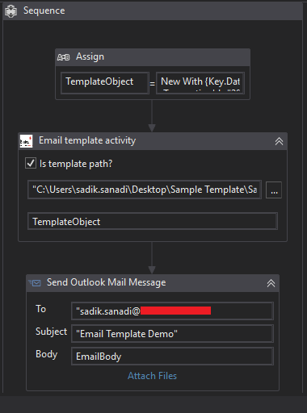

# Razor Email Template Activity

## Introduction
Razor Email Template Activity using Razor view engine to feasibly create mail content in effortless steps.
### Scope and Purpose
Razor Email Template Activity is an activity created for Uipath to generate HTML email body using Razor engine in a few handy and hassle-free steps. This activity gets .cshtml template file as input and provides the HTML content to be later sent as an email. Razor view engine is introduced in ASP.NET MVC 3. Razor supporting implemention of HTML views in web application has made the process quite user friendly . The ASP.NET team have had the great insight of making the Razor parser independent from ASP.NET which gives the user the liberty to use it outside of web applications to generate any type of document including HTML emails. Any mail sender activity, consisting of dynamically-generated HTML emails can be feasibly implemented and maintained By Razor as compared to the String.Replace() method we've all been using till date.

### Getting Started

To build this project we need Visual studio with .Net Framework 4 Client Profile. The next steps mentioned below needs to be  followed:
1) Clone this repository
2) Install below nuget packages

### Package Manager Console

```
PM> Install-Package Newtonsoft.Json
```  
```
PM> Install-Package RazorEngine -Version 3.5.0
```
```
PM> Install-Package Microsoft.AspNet.Razor -Version 2.0.30506
```
3) Compile the project
4) Create nuget package of output dll's
5) Install in UiPath Studio

### How to use Activity in UiPath

To use Email template activity, install created nuget package in Uipath Studio. Once the package is installed successfully, we can see the Email Template Activity under activity window 


After you drag and drop this activity, you will see the screen as depicted below:

 

Activity window contains a checkbox that allows the user to either provide .cshtml template file path or on unchecking the checkbox the file contents can be directly added .
 
 

The next step is to provide an appropriate object for this activity as shown in the below-mentioned screen:


 
The output  is obtained in string format 



This result needs to be passed to any mail sender activity in the Emailbody field as depicted in the below sample screen.


 
Finally you will receive an email with html email body as depicted in the below sample screen.
[ Email body rendered through sample template ]
 

### License
This project is licensed under the MIT License - see the [LICENSE](LICENSE) file for details
